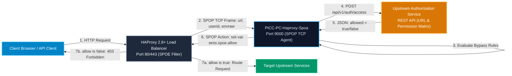
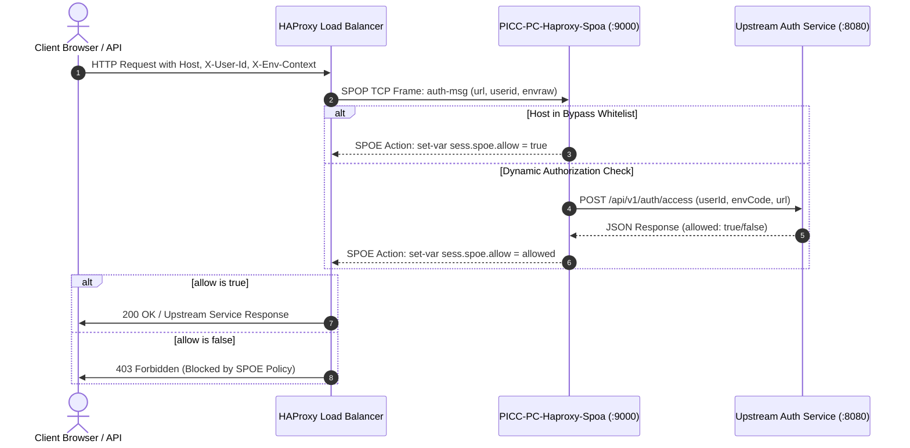

# PICC-PC-Haproxy-Spoa

[](https://golang.org/)
[](https://www.haproxy.org/)
[](LICENSE)
[](https://www.cncf.io/)
[]()

High-performance, Cloud Native **Stream Processing Offload Agent (SPOA)** for HAProxy. Provides asynchronous offload of URL accessibility evaluations, user context validation, and access control decisions across the **Platform Infrastructure and Core Components (PICC)** suite of the **Nubo Native Platform (NNP)**.

---

## Table of Contents

- [Overview](#overview)
- [Key Architectural Features](#key-architectural-features)
- [Architecture and Workflow](#architecture-and-workflow)
- [Technology Matrix](#technology-matrix)
- [Quick Start](#quick-start)
  - [Prerequisites](#prerequisites)
  - [Configuration](#configuration)
  - [Local Execution](#local-execution)
  - [Docker Container Execution](#docker-container-execution)
- [HAProxy SPOE Configuration](#haproxy-spoe-configuration)
- [Project Documentation](#project-documentation)
- [Repository Structure](#repository-structure)
- [Security and Vulnerability Management](#security-and-vulnerability-management)
- [Contributing](#contributing)
- [License](#license)

---

## Overview

**`PICC-PC-Haproxy-Spoa`** implements the **HAProxy Stream Processing Offload Protocol (SPOP)**, enabling HAProxy to offload CPU-intensive or dynamic authorization lookups to an external microservice without blocking data-plane request forwarding.

By delegating authorization verification to this standalone Go agent, platform operators can enforce centralized URL access control policies, dynamic user authorization, and multi-tenant environment routing with zero performance impact on HAProxy core routing loops.

---

## Key Architectural Features

- **High-Throughput Binary Protocol**: Implements the official HAProxy SPOP v2 binary TCP protocol via `github.com/criteo/haproxy-spoe-go`.
- **Externalized 12-Factor Configuration**: Fully configured via environment variables with safe defaults; zero hardcoded credentials, URLs, or internal cluster names.
- **Zero-Trust Fail-Safe Authorization**: Enforces strict fail-closed security. Malformed inputs, connection timeouts, or unhandled errors default to `allow=false` without crashing the daemon.
- **Resilient Upstream Communication**: Hardened `http.Client` featuring connection pooling, keep-alive tuning, and strict context timeouts.
- **Kubernetes Cloud-Native Health Probes**: Dual-plane architecture running the SPOP binary protocol on TCP port `9000` alongside an HTTP diagnostic plane on port `8080` (`/healthz`, `/readyz`, `/livez`).
- **Graceful Lifecycle Management**: Clean OS signal termination (`SIGINT`, `SIGTERM`) with connection draining.
- **Unprivileged Container Runtime**: Minimalist multi-stage Docker build running under an unprivileged non-root user (`10001:10001`).
- **DevSecOps Security Pipeline**:
  - **SAST**: Automated Go Vet and Govulncheck security scanning.
  - **SBOM**: Automated CycloneDX Software Bill of Materials generation (`bom.json`).

---

## Architecture and Workflow

### Architectural Flow



### Authorization Sequence Diagram



---

## Technology Matrix

| Category | Component / Library | Version | Role / Description |
| :--- | :--- | :--- | :--- |
| **Runtime** | Go | `1.26+` | High-concurrency compiled systems language |
| **SPOP Engine** | `criteo/haproxy-spoe-go` | `v1.0.8` | Official HAProxy Stream Processing Offload Protocol engine |
| **JSON Parser** | `tidwall/gjson` | `v1.18.0` | Fast, zero-allocation JSON extraction library |
| **Container Base** | Alpine Linux | `3.21` | Lightweight, secure unprivileged container base |
| **License** | Apache 2.0 | `2.0` | Open Source standard license |

---

## Quick Start

### Prerequisites
- [Go 1.26+](https://golang.org/dl/)
- [Docker](https://docs.docker.com/get-docker/) & Docker Compose
- [HAProxy 2.8+](https://www.haproxy.org/) (for end-to-end proxy integration)

### Configuration

Copy the configuration template and customize values:

```bash
cp .env.example .env
```

| Variable | Default | Description |
| :--- | :--- | :--- |
| `SPOA_PORT` | `:9000` | SPOE binary TCP listening port |
| `HEALTH_PORT` | `:8080` | HTTP health check and probe port (`/healthz`, `/readyz`, `/livez`) |
| `AUTH_SERVICE_URL` | `http://localhost:8080/api/v1/auth/access` | Upstream authorization service REST endpoint |
| `AUTH_TIMEOUT_SECONDS` | `5` | Upstream HTTP call timeout in seconds |
| `BYPASS_HOSTS` | *(empty)* | Comma-separated list of hostnames allowed without auth |
| `BYPASS_ENV_IDS` | `MASTER` | Comma-separated list of environment IDs to bypass auth |
| `LOG_LEVEL` | `INFO` | Log verbosity: `DEBUG`, `INFO`, `WARN`, `ERROR` |

### Local Execution

```bash
# Verify dependencies
go mod download
go mod verify

# Run tests
go test -v ./...

# Run the agent
go run .
```

### Docker Container Execution

```bash
# Build the container image
docker build -t picc-pc-haproxy-spoa:latest .

# Run container with docker-compose
docker compose up -d

# Verify container health
curl -s http://localhost:8080/healthz
```

---

## HAProxy SPOE Configuration

### 1. SPOE Agent Configuration (`spoe-auth.cfg`)

```haproxy
[auth-agent]
    messages auth-msg
    option var-prefix spoe
    timeout hello      500ms
    timeout idle       30s
    timeout processing 2000ms
    use-backend spoe-backend

spoe-message auth-msg
    args url=req.hdr(host) userid=req.hdr(X-User-Id) envraw=req.hdr(X-Env-Context)
    event on-frontend-http-request
```

### 2. HAProxy Frontend Binding (`haproxy.cfg`)

```haproxy
frontend fe_http
    bind *:80
    mode http

    # Hook the SPOE engine filter
    filter spoe engine auth-agent config /etc/haproxy/spoe-auth.cfg

    # Enforce access decision
    http-request deny deny_status 403 if !{ var(sess.spoe.allow) -m bool }

    default_backend be_app

backend spoe-backend
    mode tcp
    balance roundrobin
    server spoa1 127.0.0.1:9000 check maxconn 500
```

---

## Project Documentation

- 📘 [Development Guidelines](DEVELOPMENT_GUIDELINES.md): Architectural standards, Go code quality, and security tooling.
- 🚀 [User Manual and Deployment Guide](USER_MANUAL_AND_DEPLOYMENT_GUIDE.md): Detailed HAProxy setup, Kubernetes manifests, and operational troubleshooting.
- 🤝 [Contributing Guide](CONTRIBUTING.md): Workflow, branching, and DCO sign-off requirements.
- 📜 [Code of Conduct](CODE_OF_CONDUCT.md): Community guidelines.
- 🔐 [Security Policy](SECURITY.md): Vulnerability reporting procedures.

---

## Repository Structure

```
.
├── .github/workflows/ci-cd.yml             # GitHub Actions CI/CD automation
├── .env.example                            # Configuration environment template
├── .gitattributes                          # Git file attributes and line endings
├── .gitignore                              # Git exclusion rules
├── Dockerfile                              # CNCF-compliant multi-stage Docker build
├── docker-compose.yml                      # Container orchestration setup
├── go.mod                                  # Go module definitions
├── go.sum                                  # Cryptographic checksums
├── spoa.go                                 # Core SPOA agent and health probe server
├── spoa_test.go                            # Automated unit tests
├── CODE_OF_CONDUCT.md                      # Community Code of Conduct
├── CONTRIBUTING.md                         # Contribution and DCO guidelines
├── DEVELOPMENT_GUIDELINES.md               # Developer architectural standards
├── USER_MANUAL_AND_DEPLOYMENT_GUIDE.md     # Production deployment manual
├── LICENSE                                 # Apache License 2.0
├── MAINTAINERS.md                          # Project maintainers list
└── SECURITY.md                             # Security disclosure policy
```

---

## Security and Vulnerability Management

`PICC-PC-Haproxy-Spoa` follows CNCF security standards:
- **Zero Hardcoded Secrets**: Secrets and endpoints must never be stored in source code.
- **Dependency Auditing**: Tested with `govulncheck` to eliminate CVEs.
- **Vulnerability Reporting**: Report vulnerabilities according to [SECURITY.md](SECURITY.md).

---

## Contributing

Contributions are welcome under the **Apache 2.0 License**. Please review [CONTRIBUTING.md](CONTRIBUTING.md) and sign off on all commits per the Developer Certificate of Origin (DCO).

---

## License

Licensed under the **Apache License 2.0** — see [LICENSE](LICENSE) for details.
