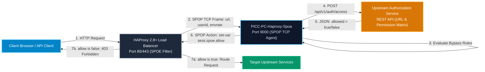

# User Manual and Deployment Guide: `PICC-PC-Haproxy-Spoa`

This document provides a comprehensive operational and deployment guide for the **`PICC-PC-Haproxy-Spoa`** agent within the **Nubo Native Platform (NNP)** ecosystem. It details configuration parameters, HAProxy SPOE engine integration, containerization, production Kubernetes manifests, and operational troubleshooting.

---

## Table of Contents

1. [Service Architecture & Role](#1-service-architecture--role)
2. [Prerequisites & System Requirements](#2-prerequisites--system-requirements)
3. [Configuration Reference](#3-configuration-reference)
4. [HAProxy SPOE Integration Setup](#4-haproxy-spoe-integration-setup)
   - [HAProxy SPOE Configuration File (`spoe-auth.cfg`)](#haproxy-spoe-configuration-file-spoe-authcfg)
   - [HAProxy Frontend Integration (`haproxy.cfg`)](#haproxy-frontend-integration-haproxycfg)
5. [Local Build & Containerization](#5-local-build--containerization)
   - [Building Locally](#building-locally)
   - [Docker Container Build](#docker-container-build)
   - [Docker Compose Multi-Container Setup](#docker-compose-multi-container-setup)
6. [Production Deployment on Kubernetes](#6-production-deployment-on-kubernetes)
   - [Kubernetes Deployment & Service Manifests](#kubernetes-deployment--service-manifests)
   - [Liveness, Readiness, and Startup Probes](#liveness-readiness-and-startup-probes)
7. [Observability, Metrics & Troubleshooting](#7-observability-metrics--troubleshooting)

---

## 1. Service Architecture & Role

`PICC-PC-Haproxy-Spoa` is an implementation of the **HAProxy Stream Processing Offload Protocol (SPOP)** written in Go. Rather than embedding complex authentication, token introspection, and URL permission parsing inside Lua or custom HAProxy modules, HAProxy offloads these evaluations asynchronously to `PICC-PC-Haproxy-Spoa`.



---

## 2. Prerequisites & System Requirements

| Component | Minimum Version | Recommended |
| :--- | :--- | :--- |
| **Go Runtime** (for source build) | Go 1.26 | Go 1.26+ |
| **HAProxy** | HAProxy 2.4+ | HAProxy 2.8+ LTS |
| **Container Engine** | Docker 24.0+ | Docker Engine 27+ / Podman 5+ |
| **Kubernetes** | Kubernetes 1.28+ | Kubernetes 1.30+ |

---

## 3. Configuration Reference

All configuration values are populated through environment variables.

| Environment Variable | Default Value | Description |
| :--- | :--- | :--- |
| `SPOA_PORT` | `:9000` | TCP port on which the SPOA binary agent listens for HAProxy SPOE connections. |
| `HEALTH_PORT` | `:8080` | HTTP port on which Kubernetes health endpoints (`/healthz`, `/readyz`, `/livez`) listen. |
| `AUTH_SERVICE_URL` | `http://localhost:8080/api/v1/auth/access` | Fully-qualified REST API URL for the upstream authorization evaluation service. |
| `AUTH_TIMEOUT_SECONDS` | `5` | Maximum duration (in seconds) to wait for a response from the authorization service before failing closed (deny). |
| `BYPASS_HOSTS` | *(empty)* | Comma-separated list of hostnames allowed to bypass authorization (e.g. `auth.example.com,idp.example.com`). |
| `BYPASS_ENV_IDS` | `MASTER` | Comma-separated list of environment IDs allowed to bypass authorization checks. |
| `LOG_LEVEL` | `INFO` | Logging verbosity: `DEBUG`, `INFO`, `WARN`, `ERROR`. |

---

## 4. HAProxy SPOE Integration Setup

### HAProxy SPOE Configuration File (`spoe-auth.cfg`)

Place the following configuration in `/etc/haproxy/spoe-auth.cfg`:

```haproxy
[auth-agent]
    messages auth-msg
    option var-prefix spoe
    timeout hello      500ms
    timeout idle       30s
    timeout processing 2000ms
    use-backend spoe-backend

spoe-message auth-msg
    args url=req.hdr(host) userid=req.hdr(X-User-Id) envraw=req.hdr(X-Env-Context)
    event on-frontend-http-request
```

### HAProxy Frontend Integration (`haproxy.cfg`)

Configure your frontend and the SPOA backend pool in `/etc/haproxy/haproxy.cfg`:

```haproxy
frontend fe_http
    bind *:80
    mode http

    # Enable the SPOE filter
    filter spoe engine auth-agent config /etc/haproxy/spoe-auth.cfg

    # Deny request if SPOA agent did not return allow = true
    http-request deny deny_status 403 if !{ var(sess.spoe.allow) -m bool }

    # Route approved traffic to downstream backends
    default_backend be_app

backend spoe-backend
    mode tcp
    balance roundrobin
    timeout connect 500ms
    timeout server  2500ms
    server spoa1 haproxy-spoa.infra.svc.cluster.local:9000 check maxconn 500
```

---

## 5. Local Build & Containerization

### Building Locally

```bash
# Build the binary
go build -ldflags="-s -w" -o bin/spoa .

# Run the agent locally
./bin/spoa
```

### Docker Container Build

```bash
# Build the production container
docker build -t picc-pc-haproxy-spoa:latest .

# Run container with custom environment
docker run -d \
  --name haproxy-spoa \
  -p 9000:9000 \
  -p 8080:8080 \
  -e AUTH_SERVICE_URL="http://auth-svc:8080/api/v1/auth/access" \
  -e BYPASS_HOSTS="auth.example.com,idp.example.com" \
  picc-pc-haproxy-spoa:latest
```

### Docker Compose Multi-Container Setup

```bash
docker compose up -d
docker compose ps
docker compose logs -f haproxy-spoa
```

---

## 6. Production Deployment on Kubernetes

### Kubernetes Deployment & Service Manifests

Create `spoa-deployment.yaml`:

```yaml
apiVersion: apps/v1
kind: Deployment
metadata:
  name: haproxy-spoa
  namespace: platform-infra
  labels:
    app.kubernetes.io/name: haproxy-spoa
    app.kubernetes.io/part-of: nubo-native-platform
spec:
  replicas: 2
  selector:
    matchLabels:
      app.kubernetes.io/name: haproxy-spoa
  template:
    metadata:
      labels:
        app.kubernetes.io/name: haproxy-spoa
    spec:
      securityContext:
        runAsNonRoot: true
        runAsUser: 10001
        runAsGroup: 10001
        fsGroup: 10001
      containers:
        - name: spoa
          image: ghcr.io/nubo-native-platform/picc-pc-haproxy-spoa:latest
          imagePullPolicy: IfNotPresent
          ports:
            - name: spoe-tcp
              containerPort: 9000
              protocol: TCP
            - name: health-http
              containerPort: 8080
              protocol: TCP
          env:
            - name: SPOA_PORT
              value: ":9000"
            - name: HEALTH_PORT
              value: ":8080"
            - name: AUTH_SERVICE_URL
              value: "http://auth-service.platform-infra.svc.cluster.local:8080/api/v1/auth/access"
            - name: AUTH_TIMEOUT_SECONDS
              value: "5"
            - name: BYPASS_HOSTS
              value: "auth.example.com,login.example.com"
            - name: BYPASS_ENV_IDS
              value: "MASTER"
            - name: LOG_LEVEL
              value: "INFO"
          resources:
            requests:
              cpu: 50m
              memory: 64Mi
            limits:
              cpu: 300m
              memory: 256Mi
          livenessProbe:
            httpGet:
              path: /livez
              port: 8080
            initialDelaySeconds: 5
            periodSeconds: 10
          readinessProbe:
            httpGet:
              path: /readyz
              port: 8080
            initialDelaySeconds: 3
            periodSeconds: 5
---
apiVersion: v1
kind: Service
metadata:
  name: haproxy-spoa
  namespace: platform-infra
  labels:
    app.kubernetes.io/name: haproxy-spoa
spec:
  type: ClusterIP
  ports:
    - name: spoe-tcp
      port: 9000
      targetPort: 9000
      protocol: TCP
    - name: health-http
      port: 8080
      targetPort: 8080
      protocol: TCP
  selector:
    app.kubernetes.io/name: haproxy-spoa
```

---

## 7. Observability, Metrics & Troubleshooting

### Diagnostic Probes
- **Liveness Check**: `curl -s http://localhost:8080/livez` -> `{"status":"ALIVE"}`
- **Readiness Check**: `curl -s http://localhost:8080/readyz` -> `{"status":"READY"}`
- **Health Check**: `curl -s http://localhost:8080/healthz` -> `{"status":"UP"}`

### Common Operational Issues

1. **HAProxy returns 403 for all requests:**
   - Verify `AUTH_SERVICE_URL` is reachable from the SPOA container.
   - Ensure the SPOE filter arguments (`url`, `userid`, `envraw`) in `spoe-auth.cfg` match the request headers sent by clients.
   - Check SPOA logs with `LOG_LEVEL=DEBUG` to inspect auth payloads and decisions.

2. **HAProxy logs `SPOE timeout processing`:**
   - Check latency between SPOA and the upstream authorization service.
   - Adjust `timeout processing` in `spoe-auth.cfg` or tune `AUTH_TIMEOUT_SECONDS` in SPOA.
